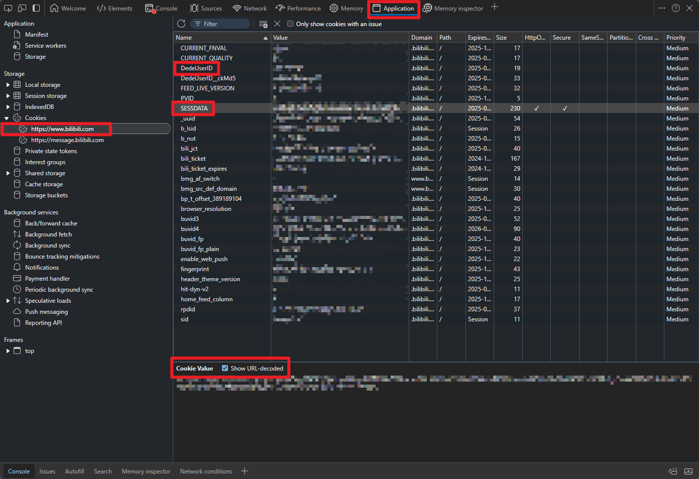

# Bilibili Visualization

一个用于分析个人B站观看习惯的可视化项目

## 使用说明

`dist` 目录为已经构建好的网页

`scripts` 目录为python脚本目录

## 运行前准备

1. 准备一个python环境
`pip install requests`

2. 配置用户信息以便爬取观看记录
修改 `scripts/config.py` 中的 `sessdata` 与 `mid`，获取方法如下：
登录B站网页端，按下F12进入开发模式，依次选择 Application - Cookies - b站

其中 `DedeUserID` 即为 `mid` 信息
`SESSDATA` 需要在选中后，点击下方的 **Show URL-decoded** 后查看
将 `sessdata` 与 `mid` 填写进 `config.py` 文件中

## 运行

`python scripts/main.py`

## QA

- 爬取数据时间较长，请耐心等待

- B站仅留存最近1200-1300条浏览记录

- 如果需要更换用户，请在运行前清除 `dist/data` 目录下的残留数据

- 如果面板中出现了名字为空的情况，说明该视频/作者已经被删除/注销
